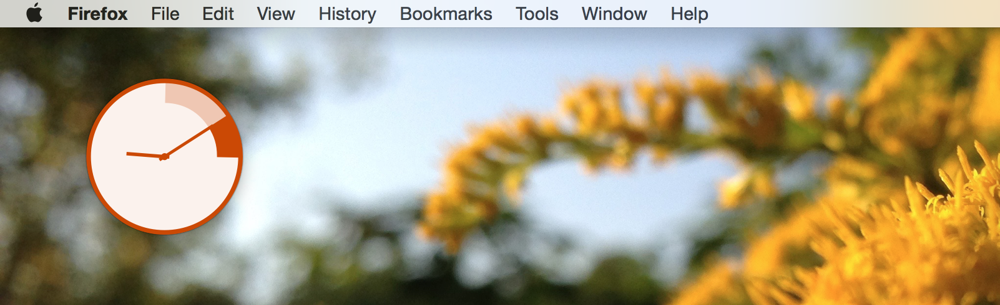

Pocketwatch: An always-at-the-edge-of-your-awareness pomodoro timer.
====================================================================

This code is INCOMPLETE.

Dependencies:
- Python 2.7
- PyQT 5 along with its dependencies
- There's a small amount of OSX-specific code, so for now you need the Python
  Objective-C bridge (`pip install pyobjc`)
